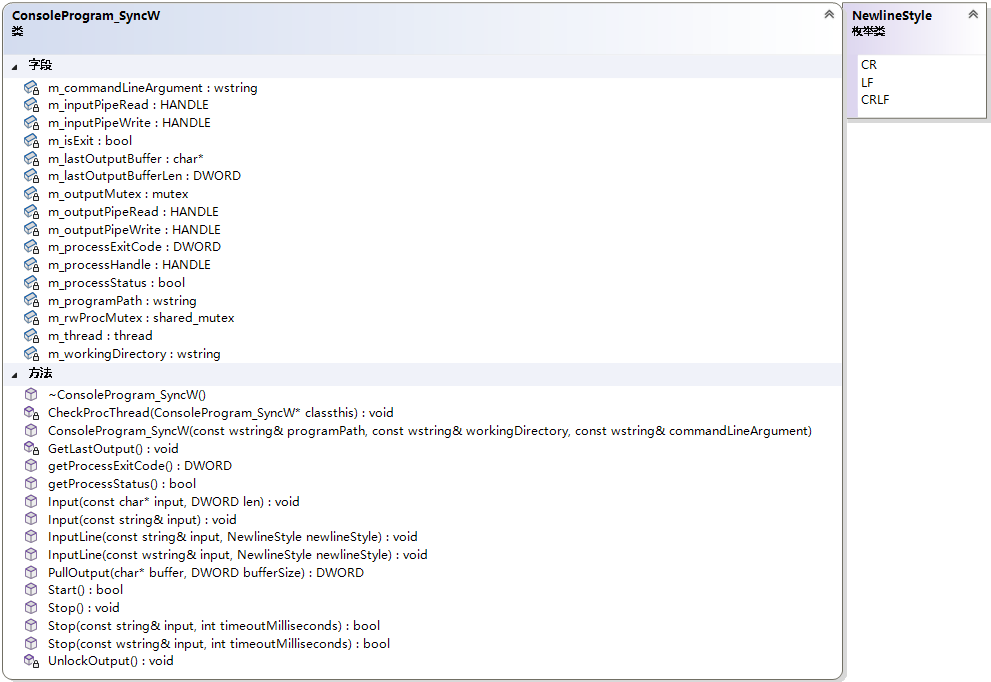

# 控制台程序操作类

# ConsoleProgramOperationClass

## 简介

可以操作控制台程序的C++类，使用C++17标准

只适用于Windows平台！

## ConsoleProgram_Sync

同步版本的控制台程序操作类，分为使用GBK等多字节字符集和使用unicode字符集(这里特指Windows API的UTF-16，即wchar_t)两种版本

多字节字符集的为``ConsoleProgram_SyncA``，unicode字符集的为``ConsoleProgram_SyncW``

本类的类图如下：

ConsoleProgram_SyncA版本：

ConsoleProgram_SyncW版本：

## 许可证

本程序遵循 [GPL-3.0-only](https://opensource.org/license/gpl-3-0/)许可证。

本程序仅供学习研究使用，严禁用于商业用途！

> 注意：由于GPL协议的强约束性，如果您将本项目的代码用于您的商业项目，会导致您商业项目的所有代码被迫全部以相同协议开源

本项目许可证的具体内容详见项目根目录下的LICENSE文件

您也可访问[GNU的网站](https://www.gnu.org/licenses/)获取更多有关GPL许可证以及自由软件运动的相关信息

## 联系方式

如果您要联系我或询问问题，请发送邮件到我的邮箱：xy0797official@qq.com